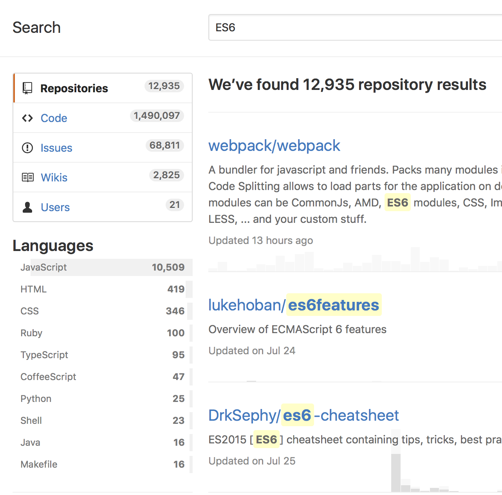
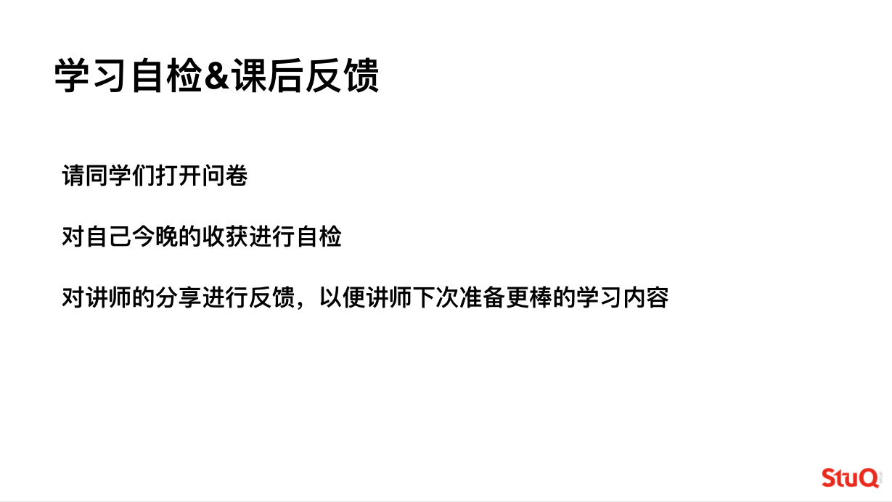

ES6: QuickStart and Tips
------------------------

ES6: 快速体验，及实用小贴士

> 2016 年是 ES6 大力推广和普及的黄金时期，也是今年的流行趋势，
> 就一个 [ES6](https://github.com/search?o=desc&q=ES6&s=stars&type=Repositories&utf8=✓) 关键词，
> 在 GitHub 上就有这么多搜索结果。（赶紧跟上大部队！）




## 简介

ES6 是 **ECMAScript 6** 的简称，是 [ECMA-262 的第 6 版本](http://www.ecma-international.org/ecma-262/6.0/index.html)。


* ES5、ES2015 / ES6、ES2016 / ES7、ES2017 / ES8 这些关键词具体代表什么？

  [ES5] 发布于 2009 年。  

  [ES6]，比起 ES5，是第一个大版本更新，在 2015-06 发布，所以又称 ES2015。  

  [ES7 和 ES8] 统称为 ECMAScript Next。  

  [ES7] 在 2016-06 发布，又称 ES2016。  

  ES8 在 2017-06 发布，又称 ES2017。

* ECMAScript 与 JavaScript 有什么关系？

  前者是后者的语言标准，后者是前者的一个实现。

* ES6 在浏览器，Node.js 支持如何，适不适合开发，生产？

  - 浏览器： [ECMAScript 兼容列表](http://kangax.github.io/compat-table/es6/)

  - Node.js：[ES2015 Support](http://node.green)

  - 工具：使用一些转换工具，可以把 ES6 => ES5


* 为什么要学习新语法？

  当前很多库、框架、工具都在使用 **ES6+** 进行开发，典型的就是 React 和 Vue，使用新语法特性的优势进行快速开发，然后使用转换构建工具部署生产代码。


## ES6 新特性


### Arrows and Lexical This

  「箭头」函数（`=>`）和 `this`：

  > 使用「箭头」函数我们可以体验函数式编程的”美”，高效、简洁，当然也要注意上下文 `this`。

  * e.g.

    ```js
    // old
    var sum = function (a, b) { return a + b }
    ```

    ```js
    // new
    var sum = (a, b) => a + b
    ```

  * 猜猜猜

    0. *a.js*

      ```js
      var PI = 3.14

      var c = r => 2 * PI * r

      // c(2) = ?
      ```

    0. *b.js*

      ```js
      var PI = 3.14

      var circle = {
        PI: 3.14159,
        c: r => 2 * this.PI * r
      }

      // circle.c(2) = ?
      ```

    0. *c.js*

      ```js
      var PI = 3.14

      var circle = {
        PI: 3.14159,
        c (r) {
          return 2 * this.PI * r
        }
      }

      // circle.c(2) = ?
      ```


### Classes

  类：

  > 基于原型链的语法糖，简单、清晰；面向对象编程更加轻松。  
  > 再也不会被其他语言吐槽了！

  * e.g.

    ```js
    // old
    function Cat () {
      this.voice = 'miao'
    }
    Cat.prototype.speak = function () {
      console.log(this.voice)
    }

    function Lion () {
      this.voice = 'roar'
    }

    Lion.prototype = Cat.prototype

    var c = new Cat()
    var l = new Lion()
    c.speak()
    l.speak()
    ```

    ```js
    // new
    class Cat {
      constructor () {
        this.voice = 'miao'
      }

      speak () {
        console.log(this.voice)
      }
    }

    class Lion extends Cat {
      constructor () {
        super()

        this.voice = 'roar'
      }
    }
    var c = new Cat()
    var l = new Lion()
    c.speak()
    l.speak()
    ```

  * 猜猜猜

    0. *cat.js*

      ```js
      class Cat {
        constructor () {
          this.voice = 'miao'
        }

        speak () {
          console.log(this.voice)
        }

        static type () {
          return Cat.name.toLowercase()
        }
      }

      // Cat.prototype= ?
      ```

    0. *getters-setters.js*

      ```js
      class Cat {
        constructor (options) {
          this.voice = 'miao'
          this.options = options || {}
        }

        speak () {
          console.log(this.voice)
        }

        get name () {
          return this.options.name
        }

        set name (name) {
          this.options.name = name
        }
      }

      var a = new Cat({ name: 'Garfield' })
      // a.name ?
      // a.name = 'Tom'
      // a.name ?
      ```

    0. *[mixins.js](https://developer.mozilla.org/en-US/docs/Web/JavaScript/Reference/Classes)*

      ```js
      var CalculatorMixin = Base => class extends Base {
        calc() { }
      }

      var RandomizerMixin = Base => class extends Base {
        randomize() { }
      }

      class Foo { }
      class Bar extends CalculatorMixin(RandomizerMixin(Foo)) { }

      // Bar.prototype ?
      ```


### Enhanced Object Literals

  改进对象声明：

  > 大大减少了代码量，创建对象更加简洁。

  - 属性缩写

  - 函数缩写

  - 属性名计算

  * e.g.

    ```js
    // old
    var a = 1
    var b = 2
    var c = 3

    var o = {
      a: a,
      b: b
      c: c,
      d: function () {
        return this.a + this.b + this.c
      }
    }
    ```

    ```js
    // new
    var o = {
      a,
      b,
      c,
      d () {
        return this.a + this.b + this.c
      }
    }
    ```

  * 猜猜猜

    0. *returns.js*

      ```js
      var generate = (name, age) => ({ name, age })

      // generate('github', 5) ?
      ```

    0. *cumputed-properties.js*

      ```js
      var create = (path, verb) => {
        return {
          path,
          verb,
          ['is' + verb[0].toUpperCase() + verb.substring(1)]: true
        }
      }

      // create('/', 'get') ?
      ```

    0. *complicated.js*

      ```js
      var path = '/'
      var verb = 'get'
      var root = {
        path,
        verb
      }

      var route = {
        root
      }
      ```


### Template Strings

  模板字符串：

  > 终于可以舒服的写多行字符串了，这功能等到花儿都谢了！

  - 支持多行

  - 支持变量绑定

  - 也支持对字符串不转义，不解析

  * e.g.

    ```js
    // old
    var first = 1
    var second = 2
    var third = 3

    var str = 'No.' + first + '\n' +
      'No.' + second +'\n' +
      'No.' + third
    ```

    ```js
    // new
    var first = 1
    var second = 2
    var third = 3

    var str = `No. ${first}
    No. ${second}
    No. ${third}
    `
    ```

  * 猜猜猜

    0. *raw-tag.js*

      ```js
      var t0 = `In ES5 "\n" is a line-feed.`
      var t1 = String.raw`In ES5 "\n" is a line-feed.`

      // console.log(t0)
      // console.log(t1)
      ```

    0. *expression.js*

      ```js
      var a = 5
      var b = 10

      // console.log("Fifteen is " + (a + b) + " and\nnot " + (2 * a + b) + ".")
      // console.log(`Fifteen is ${a + b} and\nnot ${2 * a + b}.`)
      ```

    0. *custom-tag.js*

      ```js
      var generatePath = (strings, ...values) => {
        return strings[0] + values.reduce((prev, curr) => `${prev}/${curr}`, '')
      }

      var user = 'user'
      var id = '233'
      var profile = 'profile'
      // generatePath`GET: ${user}${id}${profile}`
      ```


### Destructuring

  解析赋值

  > 可以轻松获取对象、数组等的元素，并赋值到指定变量

  - Array ArrayLike Object 等，具有迭代器接口的对象

  * e.g.

    ```js
    // old
    var arr = [1, 2, 3, 4]

    var a0 = arr[0]
    var a1 = arr[1]
    var a2 = arr[2]

    var obj = {
      name: 'github',
      age: 5
    }

    var name = obj.name
    var age = obj.age
    ```

    ```js
    // new
    var arr = [1, 2, 3, 4]

    var [a0, a1, a2] = arr

    var obj = {
      name: 'github',
      age: 5
    }

    var { name, age } = obj
    ```

  * 猜猜猜

    0. *print.js*

      ```js
      var print = ({ name, age }) => console.log(name, age)

      // print({ name: 'ES6', age: 2015 }) ?
      ```

    0. *alias.js*

      ```js
      var js = { name: 'ES6', age: 2015 }

      var { name: es, age } = js
      // name, es, age?
      ```

    0. *defaults.js*

      ```js
      var js = { name: 'ES6', age: 2015 }
      var date = [2015, 9, 14]

      var { version = '6' } = js
      // version ?

      var { fullname: f = 'ECMAScript 6' } = js
      // fullname, f ?

      var [y, m, d, h = 9] = date
      // y, m, d, h ?
      ```


### Default + Rest + Spread

  默认值、余下参数（Rest），数组展开（Spread）

  - 默认值： 减少了对输入参数的检查的代码量，即可读又简洁

  - Rest：对参数数组操作更加灵活

  - Spread：可以看作是 Rest 的反操作，更加方便对数组的操作

  * e.g.

    ```js
    // old
    function bar (a) {
      a = a || 5
    }

    function sum (a) {
      a = a || 5
      var l = arguments.length
      var i = 1
      for (; i < l; ++i) {
        a += arguments[i]
      }
      return a
    }

    function apply () {
      function fn () {}
      var l = arguments.length
      var args = new Array(l)
      for (var i = 0; i < l; ++i) {
        args[i] = arguments[i]
      }
      fn.apply(null, args)
    }
    ```

    ```js
    // new
    function bar(a = 5) {
    }

    function sum (a = 5, ...args) {
      var l = args.length
      var i = 0
      for (; i < l; ++i) {
        a += args[i]
      }
      return a
    }

    function apply (...args) {
      function fn () {}
      fn.apply(null, args)
    }
    ```

  * 猜猜猜

    0. *string.js*

      ```js
      var str = '1234567890'

      // [...str] ?
      ```

    0. *concat.js*

      ```js
      var a = [1, 2, 3]
      var b = [6, 5, 4]

      var c = [...a, ...b]
      // c ?
      ```

    0. *parse-args.js*

      ```js
      /**
       * 解析参数，返回特定格式
       *
       * @return {Array} [arr, options, cb]
       */

      function parseArgs (...args) {
        const last = args[args.length - 1]
        const type = typeof last
        let opts
        let cb

        if ('function' === type) {
          cb = args.pop()
          if ('object' === typeof args[args.length - 1]) {
            opts = args.pop()
          }
        } else if ('object' === type && !Array.isArray(last)) {
          opts = args.pop()
        } else if ('undefined' === type) {
          args.pop()
          return parseArgs(...args)
        }

        if (Array.isArray(args[0])) {
          args = args[0]
        }
        return [args, opts || {}, cb]
      }

      // parseArgs('users') ?
      // parseArgs('users', {}) ?
      // parseArgs('users', () => {}) ?
      // parseArgs('users', {}, () => {}) ?
      // parseArgs('users', 'books') ?
      // parseArgs(['users', 'books']) ?
      ```


### Let + Const

  变量、常量定义声明：

  > 当满世界都是 `var` 的时候，变量管理是个神坑！

  - 块级作用域

  - const: 一次性声明

  * e.g.

    ```js
    // old
    // 函数作用域下覆盖全局作用域
    var bar = 1
    var bar = 3
    function method () {
      console.log(bar) // undefined
      var bar = 2
    }

    // 变量泄漏
    var s = 'hello';
    for (var i = 0; i < s.length; i++) {
      console.log(s[i]);
    }
    console.log(i); // 5
    ```

    ```js
    // new
    let bar0 = 1
    let bar1 = 3

    function method () {
      console.log(bar0)
      let bar3 = 2
    }

    var s = 'hello';
    for (let i = 0; i < s.length; i++) {
      console.log(s[i]);
    }
    ```

  * 猜猜猜

    0. *global.js*

      ```js
      var a = 1
      let b = 2
      const c = 3

      // this.a ?
      // this.b ?
      // this.c ?
      ```

    0. *for.js*

      ```js
      var s = 'hello';
      for (let i = 0; i < s.length; i++) {
        console.log(s[i]);
      }
      console.log(i); // ?
      ```


### Iterators + For..Of

  迭代器和 `for..of`

  > 像 `[...arr]` 就是迭代器一个很好的例子。

  - 可迭代协议：ES6 定义了一套统一的标准，允许对 JavaScript 对象自定义它们的迭代行为。

  - 内置可迭代类型有 String，Array，TypedArray，Map，Set，因为在它们的原型对象上已经有了 `[Symbol.iterator]` 方法。

  * e.g.

    ```js
    // old
    var arr = [1, 2, 3]

    for (let i in arr) {
      console.log(i)
    }
    ```

    ```js
    // new
    var arr = [1, 2, 3]

    for (let i of arr) {
      console.log(i)
    }
    ```

  * 猜猜猜

    0. *for-loops.js*

      ```js
      Array.prototype.arrCustom = function () {}
      var arr = [1, 2, 3]
      arr.isArray = true

      for (let i in arr) {
        console.log(i) // ?
      }

      for (let i of arr) {
        console.log(i) // ?
      }
      ```

    0. *iterable.js*

      ```js
      var iterable = {
        [Symbol.iterator]() {
          return {
            i: 0,
            next () {
              return {
                done: this.i === 10,
                value: this.i++
              }
            }
          }
        }
      }

      for (const i of iterable) {
        console.log(i) // ?
      }

      // [...iterable] ?
      ```

    0. *iterator.js*

      ```js
      var iterable = {
        [Symbol.iterator]() {
          return {
            i: 0,
            next () {
              const done = this.i === 10
              const value = done ? undefined : this.i++
              return { done, value }
            }
          }
        }
      }

      const iterator = iterable[Symbol.iterator]()

      iterator.next() // ?
      iterator.next() // ?
      iterator.next() // ?
      // ...

      const iterator2 = iterable[Symbol.iterator]()

      iterator2.next() // ?
      iterator2.next() // ?
      iterator2.next() // ?
      // ...
      ```


### Generators

  生成器：

  > 生成器大杀器！

  - [可迭代](https://developer.mozilla.org/en-US/docs/Web/JavaScript/Reference/Iteration_protocols#iterable)

  - [遵循迭代器协议](https://developer.mozilla.org/en-US/docs/Web/JavaScript/Reference/Iteration_protocols#iterator)

  - 可在单个函数内 `GeneratorFunction` 自定义迭代逻辑，可以替代迭代器，功能更强大

  - 可中断

  - 可赋值

  * e.g.

    ```js
    // old
    var iterable = {
      [Symbol.iterator]() {
        return {
          i: 0,
          next () {
            const done = this.i === 10
            const value = done ? undefined : this.i++
            return { done, value }
          }
        }
      }
    }
    const iterator = iterable[Symbol.iterator]()
    ```

    ```js
    // new
    function* generatable () {
      for (let i = 0, l = 10; i < l; ++i) {
        yield i
      }
    }
    const iterator = generatable()
    ```

  * 猜猜猜

    0. *generatable.js*

      ```js
      function* generatable () {
        for (let i = 0, l = 10; i < l; ++i) {
          yield i
        }
      }
      const iterator = generatable()

      for (const i of generatable()) {
        console.log(i) // ?
      }
      // [...generatable()] ?
      ```

    0. *next.js*

      ```js
      function* range(min = 0, max = 10, step = 1) {
        for (; min < max; min += step) {
          let rest = yield min
          if (rest) min = step * -1
        }
      }

      const iterator = range()

      iterator.next() // ?
      iterator.next() // ?
      iterator.next() // ?
      iterator.next(true) // ?
      iterator.next() // ?
      iterator.next() // ?
      iterator.next() // ?

      const iterator2 = range(0, 100, 2)

      [...iterator2] // ?
      iterator.next() // ?
      ```

    0. *return.js*

      ```js
      function* range(min = 0, max = 10, step = 1) {
        for (; min < max; min += step) {
          let rest = yield min
          if (rest) min = step * -1
        }
      }

      const iterator = range()
      iterator.next()
      iterator.next(true)
      iterator.next()
      iterator.return() // ?
      iterator.next() // ?
      iterator.return(1) // ?
      iterator.next() // ?
      ```

    0. *yield.js*

      ```js
      function* g() {
        yield 1
        yield 2
        yield 3
        yield* [4, 5, 6]
        yield* 'Hello World!'
        yield 7
      }

      [...g()] // ?
      ```


### Unicode

  Unicode

  - 加强对 Unicode 的支持，并且扩展了字符串对象

  * e.g.

    ```js
    // same as ES5.1
    "𠮷".length == 2

    // new RegExp behaviour, opt-in ‘u’
    "𠮷".match(/./u)[0].length == 2

    // new form
    "\u{20BB7}" == "𠮷" == "\uD842\uDFB7"

    // new String ops
    "𠮷".codePointAt(0) == 0x20BB7

    // for-of iterates code points
    for(var c of "𠮷") {
      console.log(c);
    }
    ```


### Modules ?

  模块化系统目前还未实现！


### Subclassable Built-ins

  子类可继承自内置数据类型

  > 真的太方便了，比如想对 Array 进行扩展，现在无需修改 `Array.prototype`，`extends Array` 就可以了。

  - Array Boolean String Number Map Set Error RegExp Function Promise

  * e.g.

    ```js
    // old
    // This is danger.
    Array.prototype.sum = function () {
      return this.reduce((t, curr) => t + curr, 0)
    }

    var a = [1, 2, 3]
    a.sum()
    ```

    ```js
    // new
    class CustomArray extends Array {
      constructor (...args) {
        super(...args)
      }

      sum () {
        return this.reduce((t, curr) => t + curr, 0)
      }
    }

    var a = CustomArray.from([1, 2, 3])
    a.sum()
    ```

  * 猜猜猜

    0. *[middleware.js](https://github.com/trekjs/middleware)*

      ```js
      const SYMBOL_ITERATOR = Symbol.iterator

      class Middleware extends Array {

        [SYMBOL_ITERATOR] () {
          return this
        }

        next (i = 0, context, nextFunc) {
          const fn = this[i] || nextFunc

          return {
            done: i === this.length,
            value: fn && fn(context, () => {
              return this.next(i + 1, context, nextFunc).value
            })
          }
        }

        compose (context, nextFunc) {
          return this[SYMBOL_ITERATOR]().next(0, context, nextFunc).value
        }

      }

      const middleware = new Middleware()

      middleware.push((ctx, next) => {
        ctx.arr.push(1)
        next()
        ctx.arr.push(6)
      })

      middleware.push((ctx, next) => {
        ctx.arr.push(2)
        next()
        ctx.arr.push(5)
      })

      middleware.push((ctx, next) => {
        ctx.arr.push(3)
        next()
        ctx.arr.push(4)
      })

      const ctx = { arr: [] }
      middleware.compose(ctx)
      console.log(ctx.arr) // ?
      ```


### Map + Set + WeakMap + WeakSet

  新增 `Map` `Set` `WeakMap` `WeakSet` 几种高效的数据类型

  * e.g.

    ```js
    // Sets
    var s = new Set();
    s.add("hello").add("goodbye").add("hello");
    s.size === 2;
    s.has("hello") === true;

    // Maps
    var m = new Map();
    m.set("hello", 42);
    m.set(s, 34);
    m.get(s) == 34;

    // Weak Maps
    var wm = new WeakMap();
    wm.set(s, { extra: 42 });
    wm.size === undefined

    // Weak Sets
    var ws = new WeakSet();
    ws.add({ data: 42 });
    // Because the added object has no other references, it will not be held in the set
    ```


### Proxies

  > 当我们不想把对象暴露出来，不想直接操作它们，想增加一层校验时，`Proxies` 是一个最佳方案。  
  > 但当增加了 `Proxies` 这一层，对性能还是会有影响的。

  * e.g.

    ```js
    // old
    const inner = {
      name: 'ES6'
    }

    var outer = {
      inner,
      get name () {
        return this.inner.name
      },
      set name (name) {
        this.inner.name = name
      }
    }

    // outer.name
    ```

    ```js
    // new
    const inner = {
      name: 'ES6'
    }

    var p = new Proxy(inner, {
      get (target, name) {
        return target[name]
      },

      set (target, name, value) {
        if ('string' !== typeof value) throw new TypeError('value must be String!')
        target[name] = value
      }
    })

    p.name
    p.name = 2
    p.name = 'ES2015'
    ```

  * 猜猜猜

    0. *[delegate-proxy.js](https://github.com/fundon/delegate-proxy)*

      ```js
      function delegateProxy (target, origin) {
        return new Proxy(target, {
          get (target, key, receiver) {
            if (key in target) return Reflect.get(target, key, receiver)
            const value = origin[key]
            return 'function' === typeof value ? function method () {
              return value.apply(origin, arguments)
            } : value
          },
          set (target, key, value, receiver) {
            if (key in target) return Reflect.set(target, key, value, receiver)
            origin[key] = value
            return true
          }
        })
      }

      const bar = {
        n: 1,

        add (i) {
          this.n += i
        }
      }

      const foo = {

        set (n) {
          this.n = n | 0
        },

        sub (i) {
          this.n -= i
        }

      }

      const p = delegateProxy(foo, bar)

      bar
      foo
      p

      p.n       // ?
      p.add(1)
      p.n       // ?

      p.sub(2)
      p.n       // ?

      p.set(1)
      p.n       // ?

      p.n = 233
      p.n       // ?
      ```


### [Symbols](https://developer.mozilla.org/en-US/docs/Web/JavaScript/Reference/Global_Objects/Symbol)

  符号：

    - 唯一性

    - 不可变

    - 不列入对象的 `Object.getOwnPropertyNames(obj)` 和 `Object.keys(obj)`

    - 安全（在一些场景下可以作为私有属性的 `key`）

  > 想给对象打一个暗号，再也不难了！

  * e.g.

    ```js
    // old
    let obj = {
      id: 1
    }

    obj.id      // 1
    obj.id = 2
    obj.id      // 2
    ```

    ```js
    // new
    let obj = {
      [Symbol('id')]: 1
    }

    obj[Symbol('id')]      // undefined
    obj[Symbol('id')] = 2
    obj[Symbol('id')]      // undefined

    for (const k of Object.getOwnPropertySymbols(obj)) {
      console.log(obj[k])
    }
    ```


### Math + Number + String + Array + Object APIs

  新增 APIs，数据操作更加方便。

  * e.g.

    ```js
    Number.EPSILON
    Number.isInteger(Infinity) // false
    Number.isNaN("NaN") // false

    Math.acosh(3) // 1.762747174039086
    Math.hypot(3, 4) // 5
    Math.imul(Math.pow(2, 32) - 1, Math.pow(2, 32) - 2) // 2

    "abcde".includes("cd") // true
    "abc".repeat(3) // "abcabcabc"

    Array.from(document.querySelectorAll("*")) // Returns a real Array
    Array.of(1, 2, 3) // Similar to new Array(...), but without special one-arg behavior
    [0, 0, 0].fill(7, 1) // [0,7,7]
    [1,2,3].findIndex(x => x == 2) // 1
    ["a", "b", "c"].entries() // iterator [0, "a"], [1,"b"], [2,"c"]
    ["a", "b", "c"].keys() // iterator 0, 1, 2
    ["a", "b", "c"].values() // iterator "a", "b", "c"

    Object.assign(Point, { origin: new Point(0,0) })
    ```


### Binary and Octal Literals

  二进制 `b`，八进制 `o` 字面量

  * e.g.

    ```js
    0b111110111 === 503 // true
    0o767 === 503 // true
    0x1f7 === 503 // true
    ```


### Promises

  Promises：更加优雅的异步编程方式。想更加清晰了解 `Promise` 的执行过程，可以看这个可视化工具 [promisees](https://github.com/bevacqua/promisees)。

  > 面对异步编程，`callback-hell` 就是 JavaScript 给人的最大诟病！  

  * e.g.

    ```js
    // old
    getProfileById(233, (err, res) => {
      if (err) throw err
      getFollowing(233, (err, following) => {
        if (err) throw err
        getFollowers(233, (err, followers) => {
          if (err) throw err
          getStarred(233, (err, starred) => {
            if (err) throw err
            // ....
          })
        })
      })
    })
    ```

    ```js
    // new
    getProfileById(233)
      .then(res => getFollowing(233))
      .then(res => getFollowers(233))
      .then(res => getStarred(233))
      .catch(err => console.log(err))
      // ...
    ```

  * 猜猜猜

    0. *simple-promise.js*

      ```js
      function loadImage (url) {
        return new Promise((resolve, reject) => {
          const img = new Image()

          img.onload = function () {
            resolve(img)
          }

          img.onerror = function () {
            reject(new Error('Could not load image at ' + url))
          }

          img.url = url
        })
      }

      loadImage('https://nodejs.org/static/images/logo-header.png')
        .then(img => document.body.appendChild(img))
        .catch(err => console.log(err))
      ```

    0. *all.js*

      ```js
      function delay(value, duration = 0) {
        return new Promise((resolve, reject) => {
          setTimeout(() => resolve(value), duration)
        })
      }

      let res = Promise.all([
        delay(10, 1),
        delay(8, 2),
        delay(6, 3),
        delay(4, 4),
        delay(2, 5),
        delay(0, 6),
      ])

      res.then(arr => {
        console.log(arr) // ?
      })
      ```

    0. *race.js*

      ```js
      function delay(value, duration = 0) {
        return new Promise((resolve, reject) => {
          setTimeout(() => resolve(value), duration)
        })
      }

      let res = Promise.race([
        delay(10, 1),
        delay(8, 2),
        delay(6, 3),
        delay(4, 4),
        delay(2, 5),
        delay(0, 6),
      ])

      res.then(arr => {
        console.log(arr) // ?
      })
      ```

    0. *reduce.js*

      ```js
      const reduce = (arr, cb, initialValue = 0) => {
        return arr.reduce(cb, Promise.resolve(initialValue))
      }

      const cb = (prev, curr) => prev.then(v => v + curr)

      reduce([1, 2, 3, 4, 5, 6, 7, 8, 9], cb)
        .then(res => {
          console.log(res) // ?
        })
      ```


### [Reflect API](https://developer.mozilla.org/en-US/docs/Web/JavaScript/Reference/Global_Objects/Reflect)

  反射 API：公开了对象的元操作，效果跟 Proxy API 相反

  * e.g.

    ```js
    var O = {a: 1};
    Object.defineProperty(O, 'b', {value: 2});
    O[Symbol('c')] = 3;

    Reflect.ownKeys(O); // ['a', 'b', Symbol(c)]

    function C(a, b){
      this.c = a + b;
    }
    var instance = Reflect.construct(C, [20, 22]);
    instance.c; // 42
    ```


### Tail Calls

  优化了尾递归算法，保证栈不会无限增长，使得尾递归算法安全。


## 快速体验

> 对以上新特性，快速体验一番，环境包括 浏览器 和 Node.js


## 高级应用

> 深入学习特性，应用生产

* http://ramdajs.com/

* https://github.com/cujojs/most

* https://lodash.com/

* `fs.readdir` 问题

  - https://github.com/nodejs/node/issues/583

  - https://github.com/w3c/filesystem-api

* https://github.com/kriskowal/gtor/#asynchronous-generator-functions


## 兼容，代码转换

> 使用转换工具，对 ES6+ 的代码进行转换，适配浏览器或者 Node < v6


## 其他

* http://es6.ruanyifeng.com

* https://github.com/lukehoban/es6features

* https://babeljs.io/docs/learn-es2015/

* https://ponyfoo.com/articles/tagged/es6-in-depth

* https://github.com/bevacqua/es6

* https://github.com/DrkSephy/es6-cheatsheet

* https://github.com/ericdouglas/ES6-Learning

* https://github.com/addyosmani/es6-tools

* https://github.com/bevacqua/promisees


## License

授权：[署名-非商业性使用](https://creativecommons.org/licenses/by-nc/4.0/)

---

> [fundon.me](https://fundon.me) &nbsp;&middot;&nbsp;
> GitHub [@fundon](https://github.com/fundon) &nbsp;&middot;&nbsp;
> Twitter [@_fundon](https://twitter.com/_fundon)

[ES5]: https://developer.mozilla.org/en-US/docs/Web/JavaScript/New_in_JavaScript/ECMAScript_5_support_in_Mozilla

[ES6]: https://developer.mozilla.org/en-US/docs/Web/JavaScript/New_in_JavaScript/ECMAScript_6_support_in_Mozilla

[ES7 和 ES8]: https://developer.mozilla.org/en-US/docs/Web/JavaScript/New_in_JavaScript/ECMAScript_Next_support_in_Mozilla

[ES7]: http://www.ecma-international.org/ecma-262/7.0/index.html


